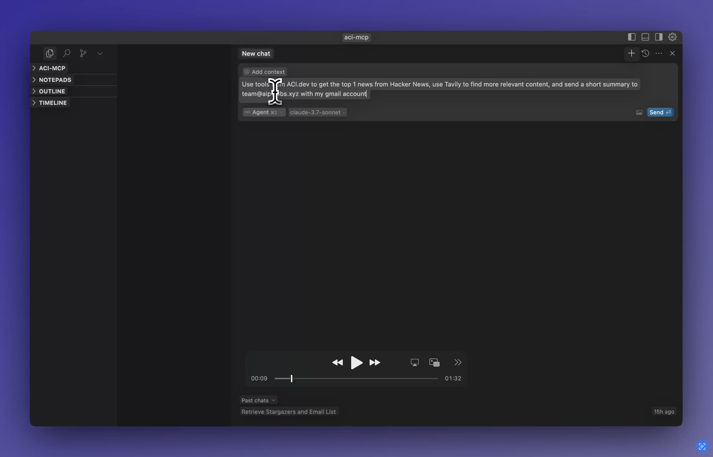

  

# ACI: Open-Source Infra to Power Unified MCP Servers

  
  
  
  
  
  
  

> [!NOTE]
> This repo is for the ACI.dev platform. If you're looking for the **Unified MCP** server built with ACI.dev, see [aci-mcp](https://github.com/aipotheosis-labs/aci-mcp).

ACI.dev is the open-source infrastructure layer for AI-agent tool-use. It gives your agents intent-aware access to 600+ tools with multi-tenant auth, granular permissions, and dynamic tool discovery—exposed as either direct function calls or through a **Unified Model-Context-Protocol (MCP) server**.

**Example:** Instead of writing separate OAuth flows and API clients for Google Calendar, Slack, and more, use ACI.dev to manage authentication and provide your AI agents with unified, secure function calls. Access these capabilities through our **Unified** [MCP server](https://github.com/aipotheosis-labs/aci-mcp) or via our lightweight [Python SDK](https://github.com/aipotheosis-labs/aci-python-sdk), compatible with any LLM framework.

Build production-ready AI agents without the infrastructure headaches.

## Demo Video

[ACI.dev **Unified MCP Server** Demo](https://youtu.be/GSR9P53-_7E?feature=shared)

## Key Features

- **600+ Pre-built Integrations**: Connect to popular services and apps in minutes.
- **Flexible Access Methods**: Use our unified MCP server or our lightweight SDK for direct function calling.
- **Multi-tenant Authentication**: Built-in OAuth flows and secrets management for both developers and end-users.
- **Enhanced Agent Reliability**: Natural language permission boundaries and dynamic tool discovery.
- **Framework & Model Agnostic**: Works with any LLM framework and agent architecture.
- **100% Open Source**: Everything released under Apache 2.0 (backend, dev portal, integrations).

## Why Use ACI.dev?

ACI.dev solves your critical infrastructure challenges for production-ready AI agents:

- **Authentication at Scale**: Connect multiple users to multiple services securely.
- **Discovery Without Overload**: Find and use the right tools without overwhelming LLM context windows.
- **Natural Language Permissions**: Control agent capabilities with human-readable boundaries.
- **Build Once, Run Anywhere**: No vendor lock-in with our open source, framework-agnostic approach.

## Common Use Cases

- **Personal Assistant Chatbots:** Build chatbots that can search the web, manage calendars, send emails, interact with SaaS tools, etc.
- **Research Agent:** Conducts research on specific topics and syncs results to other apps (e.g., Notion, Google Sheets).
- **Outbound Sales Agent:** Automates lead generation, email outreach, and CRM updates.
- **Customer Support Agent:** Provides answers, manages tickets, and performs actions based on customer queries.

## Quick Links

- **Managed Service:** [aci.dev](https://www.aci.dev/)
- **Documentation:** [aci.dev/docs](https://www.aci.dev/docs)
- **Available Tools List:** [aci.dev/tools](https://www.aci.dev/tools)
- **Python SDK:** [github.com/aipotheosis-labs/aci-python-sdk](https://github.com/aipotheosis-labs/aci-python-sdk)
- **Unified MCP Server:** [github.com/aipotheosis-labs/aci-mcp](https://github.com/aipotheosis-labs/aci-mcp)
- **Agent Examples Built with ACI.dev:** [github.com/aipotheosis-labs/aci-agents](https://github.com/aipotheosis-labs/aci-agents)
- **Blog:** [aci.dev/blog](https://www.aci.dev/blog)
- **Community:** [Discord](https://discord.com/invite/UU2XAnfHJh) | [Twitter/X](https://x.com/AipoLabs) | [LinkedIn](https://www.linkedin.com/company/aipotheosis-labs-aipolabs/posts/?feedView=all)

## Repository Structure

This is a monorepo that contains the core components of ACI.dev:

- **`/backend`**: Contains the main ACI platform server, including the APIs, core logic, database models, and the entire integration library (over 600+ tools).
- **`/frontend`**: Contains the Next.js application for the ACI.dev Developer Portal. This is the web interface for managing projects, integrations, authentication, and testing agents.

## Getting Started: Local Development

To run the full ACI.dev platform (backend server and frontend portal) locally, follow the individual README files for each component:

- **Backend:** [backend/README.md](backend/README.md)
- **Frontend:** [frontend/README.md](frontend/README.md)

## Contributing

We welcome contributions! Please see our [CONTRIBUTING.md](CONTRIBUTING.md) for more information.
