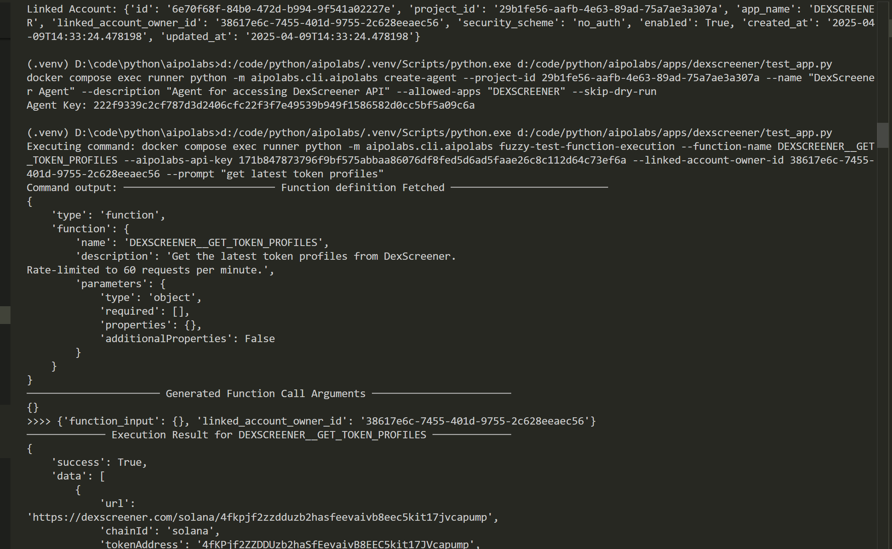

### Summary
This PR integrates DexScreener API into our application, providing users with real-time cryptocurrency and DeFi data. DexScreener is a platform that offers comprehensive information about tokens, pairs, and exchanges across multiple blockchains.

APP_URL: https://dexscreener.com
APP_API_DOCS_URL: https://docs.dexscreener.com/api/reference

### Integrated API
```
DEXSCREENER__GET_TOKEN_PROFILES
DEXSCREENER__GET_TOKEN_BOOSTS
DEXSCREENER__GET_TOP_TOKEN_BOOSTS
DEXSCREENER__CHECK_TOKEN_ORDERS
DEXSCREENER__GET_PAIRS_BY_ADDRESS
DEXSCREENER__SEARCH_PAIRS
DEXSCREENER__GET_TOKEN_POOLS
DEXSCREENER__GET_PAIRS_BY_TOKEN
```

### Fuzzy Tests
```
docker compose exec runner python -m aipolabs.cli.aipolabs fuzzy-test-function-execution --function-name DEXSCREENER__PAIRS_GET --linked-account-owner-id <LINKED_ACCOUNT_OWNER_ID> --aipolabs-api-key <AIPOLABS_API_KEY> --prompt "get information about the ETH/USDT pair on Uniswap"

docker compose exec runner python -m aipolabs.cli.aipolabs fuzzy-test-function-execution --function-name DEXSCREENER__TOKENS_SEARCH --linked-account-owner-id <LINKED_ACCOUNT_OWNER_ID> --aipolabs-api-key <AIPOLABS_API_KEY> --prompt "search for Bitcoin token information"
```

### Videos / IMAGE
