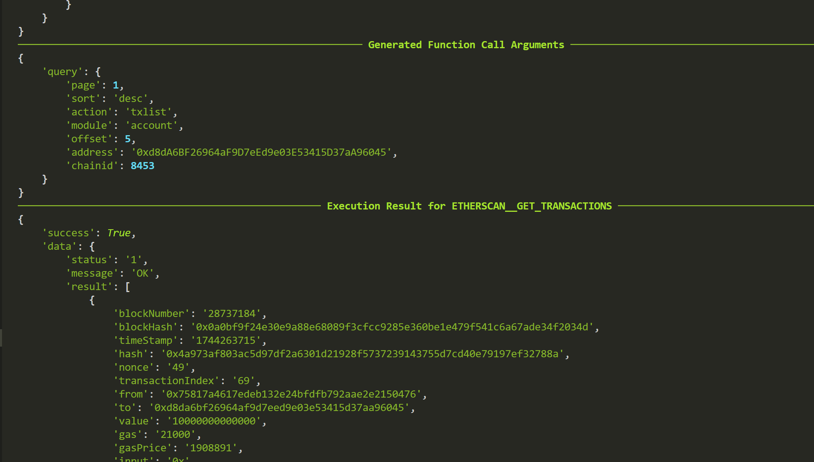

### Summary
This PR integrates Etherscan API into our application, allowing users to access Ethereum blockchain data, including account balances, transactions, smart contracts, and network statistics. Etherscan API provides a comprehensive set of endpoints to interact with Ethereum and other EVM-compatible blockchains.

APP_URL: https://etherscan.io
APP_API_DOCS_URL: https://docs.etherscan.io/etherscan-v2/api-endpoints/

### Integrated API
```
ETHERSCAN__GET_ACCOUNT_BALANCE
ETHERSCAN__GET_TOKEN_BALANCE
ETHERSCAN__GET_TRANSACTIONS
ETHERSCAN__GET_GAS_PRICE
ETHERSCAN__GET_CONTRACT_SOURCE
```

### Fuzzy Tests
```
docker compose exec runner python -m aipolabs.cli.aipolabs fuzzy-test-function-execution --function-name ETHERSCAN__GET_ACCOUNT_BALANCE --linked-account-owner-id <LINKED_ACCOUNT_OWNER_ID> --aipolabs-api-key <AIPOLABS_API_KEY> --prompt "Get the ETH balance for Vitalik Buterin's address 0xd8dA6BF26964aF9D7eEd9e03E53415D37aA96045 on Ethereum mainnet"

docker compose exec runner python -m aipolabs.cli.aipolabs fuzzy-test-function-execution --function-name ETHERSCAN__GET_TOKEN_BALANCE --linked-account-owner-id <LINKED_ACCOUNT_OWNER_ID> --aipolabs-api-key <AIPOLABS_API_KEY> --prompt "Get the USDT balance for address 0xd8dA6BF26964aF9D7eEd9e03E53415D37aA96045 on Ethereum mainnet with contract address 0xdAC17F958D2ee523a2206206994597C13D831ec7"

docker compose exec runner python -m aipolabs.cli.aipolabs fuzzy-test-function-execution --function-name ETHERSCAN__GET_TRANSACTIONS --linked-account-owner-id <LINKED_ACCOUNT_OWNER_ID> --aipolabs-api-key <AIPOLABS_API_KEY> --prompt "Get the last 5 transactions for address 0xd8dA6BF26964aF9D7eEd9e03E53415D37aA96045 on Base (chainid=8453), sorted by time in descending order"

docker compose exec runner python -m aipolabs.cli.aipolabs fuzzy-test-function-execution --function-name ETHERSCAN__GET_GAS_PRICE --linked-account-owner-id <LINKED_ACCOUNT_OWNER_ID> --aipolabs-api-key <AIPOLABS_API_KEY> --prompt "Get the current gas price estimate on Ethereum mainnet"

docker compose exec runner python -m aipolabs.cli.aipolabs fuzzy-test-function-execution --function-name ETHERSCAN__GET_CONTRACT_SOURCE --linked-account-owner-id <LINKED_ACCOUNT_OWNER_ID> --aipolabs-api-key <AIPOLABS_API_KEY> --prompt "Get the source code of the OP token contract (0x4200000000000000000000000000000000000042) on Optimism (chainid=10)"
```

### Videos / IMAGE
