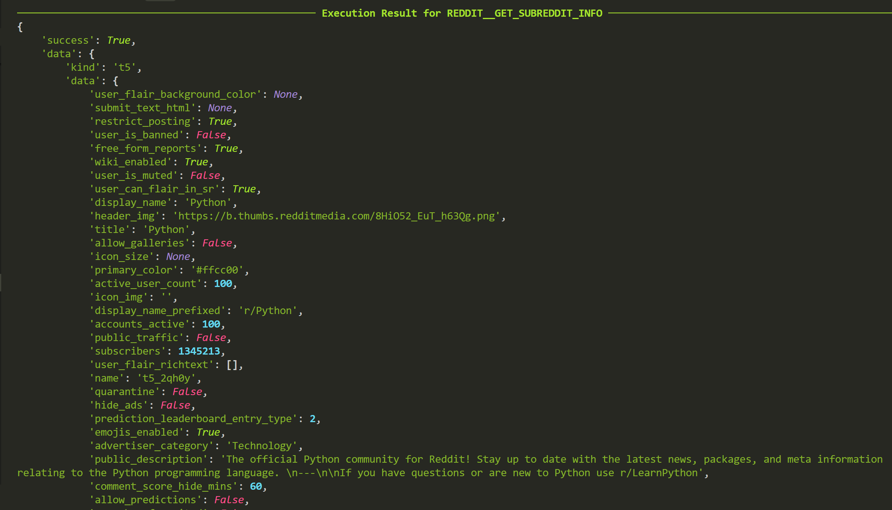

### Overview
This app integrates the Reddit API into our application, allowing users to access and manage Reddit content, including posts, comments, subreddits, and user information. The Reddit API provides rich functionality for interacting with the Reddit platform.

Application URL: https://www.reddit.com
API Documentation URL: https://www.reddit.com/dev/api/

### Integrated APIs
```
REDDIT__GET_SUBREDDIT_POSTS
REDDIT__GET_POST_COMMENTS
REDDIT__GET_USER_INFO
REDDIT__SEARCH
REDDIT__GET_SUBREDDIT_INFO
```

### Fuzzy Testing
```
docker compose exec runner python -m aipolabs.cli.aipolabs fuzzy-test-function-execution --function-name REDDIT__GET_SUBREDDIT_POSTS --linked-account-owner-id <LINKED_ACCOUNT_OWNER_ID> --aipolabs-api-key <AIPOLABS_API_KEY> --prompt "Get hot posts from r/Python subreddit"

docker compose exec runner python -m aipolabs.cli.aipolabs fuzzy-test-function-execution --function-name REDDIT__SEARCH --linked-account-owner-id <LINKED_ACCOUNT_OWNER_ID> --aipolabs-api-key <AIPOLABS_API_KEY> --prompt "Search for recent discussions about artificial intelligence"
```

### Videos / IMAGE



### Authentication
The Reddit app uses OAuth2 authentication. You'll need to:

1. Create a Reddit application at https://www.reddit.com/prefs/apps
2. Set up the following environment variables:
   - `AIPOLABS_REDDIT_APP_CLIENT_ID`: Your Reddit app's client ID
   - `AIPOLABS_REDDIT_APP_CLIENT_SECRET`: Your Reddit app's client secret

### Rate Limiting
Reddit API has rate limits that vary based on your authentication method:
- Authenticated requests: 600 requests per 10 minutes
- Unauthenticated requests: 60 requests per 10 minutes

### Best Practices
1. Always use pagination when retrieving large amounts of data
2. Cache responses when possible to avoid hitting rate limits
3. Handle errors gracefully in your application
4. Use appropriate sorting methods for your use case
5. Follow Reddit's API guidelines and terms of service

## Features

- Retrieve posts from subreddits
- Get comments for specific posts
- Search Reddit content
- Access user information
- Get subreddit details

## Error Handling

The app includes proper error handling for common Reddit API errors:
- Rate limiting
- Authentication failures
- Invalid subreddit/user names
- Network issues 